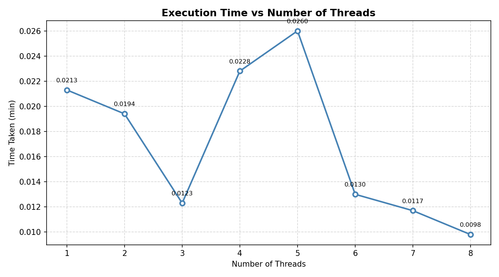

# Assignment 12 — Multi-threaded Matrix Multiplication Benchmark

## Objective
Benchmark the effect of increasing the number of threads (T = 1 to 8) on the execution time of parallel matrix multiplication using Python's `threading` module.

## Setup

| Parameter | Value |
|---|---|
| Number of matrices | 50 |
| Matrix size | 1000 × 1000 (float32) |
| Constant matrix | 1000 × 1000 (float32) |
| Max threads | 8 |
| Operation | `np.dot(random_matrix, constant_matrix)` |

## How It Works
1. A single constant matrix and 50 random matrices are generated upfront.
2. The 50 matrix indices are split into **T equal chunks**, one chunk per thread.
3. Each thread multiplies its assigned matrices against the constant matrix and stores results.
4. Wall-clock time is measured for each value of T from 1 to 8.

## Results

| Threads | 1 | 2 | 3 | 4 | 5 | 6 | 7 | 8 |
|---|---|---|---|---|---|---|---|---|
| Time (min) | 0.0213 | 0.0194 | 0.0123 | 0.0228 | 0.0260 | 0.0130 | 0.0117 | 0.0098 |

## Graph

## Observations
- Overall trend shows **decreasing execution time** as thread count increases (T=8 is fastest at 0.0098 min).
- Non-monotonic dips at T=3 and T=5 are due to Python's **GIL (Global Interpreter Lock)** — NumPy releases the GIL during `np.dot`, so true parallelism occurs, but thread scheduling overhead and BLAS internal threading cause variability.
- The best speedup is achieved at **T=8 threads** (~2.2× faster than single-threaded).

## Files
- `assignment12.ipynb` — Jupyter notebook with full benchmark code
- `execution_time.png` — Output plot of execution time vs thread count
