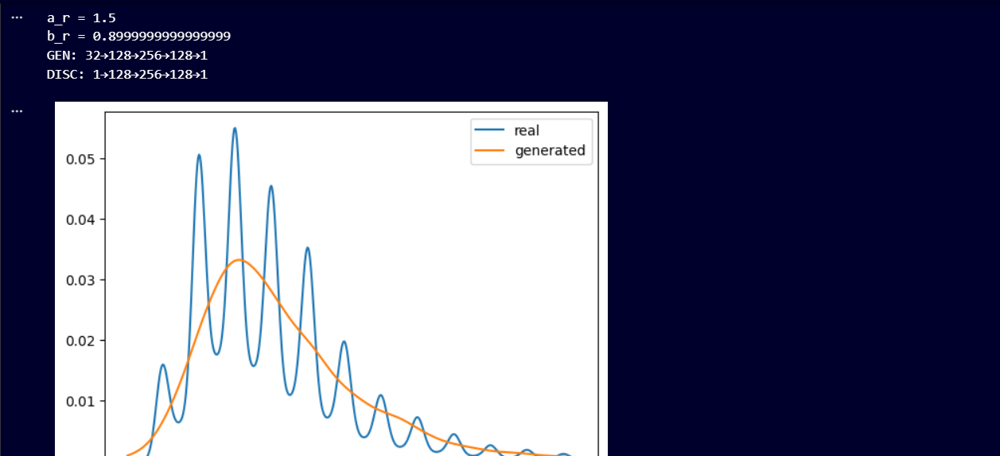
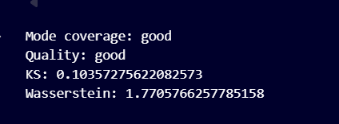

# 📄 **README — PDF Estimation Using GAN (UCS654 Assignment)**

### **Course:** UCS654

### **Topic:** Learning PDFs Using GANs

### **Student Name:** Saumil Makkar

### **Roll No:** 102303862

---

# **1. Project Overview**

This project implements a **Generative Adversarial Network (GAN)** for **probability density estimation** using only data samples — *no analytical distribution is assumed*.

The dataset contains **NO₂ concentration values**, which are transformed using a roll-number–based transformation. A GAN is then trained to learn the PDF of the transformed distribution and generate new synthetic data that matches the real distribution.

Finally, multiple visualizations and evaluation metrics are produced to validate the GAN’s performance.

---

# **2. Roll Number–based Transformation**

Given:

```plaintext
ROLL_NUMBER = 102303862
```

Transformation parameters:

$a_r = 0.5 \times (r \bmod 7) = 1.5$


$b_r = 0.3 \times (r \bmod 5 + 1) = 0.9$


The transformation applied to NO₂ values:

$z = x + 1.5 \cdot \sin(0.9x)$


This transformation introduces **non-linearity and oscillation**, making PDF estimation more challenging and suitable for GAN learning.

---

#  **3. Methodology**

## **Step 1 — Load Dataset**

Dataset loaded from `/content/data[1].csv`

Processing:

* Remove NaN values
* Keep positive values
* Remove top 1% outliers

Final cleaned vector: ( x )

---

## **Step 2 — Apply Transformation**

Using:

$z = x + a_r \sin(b_r x)$

Result: transformed data ( z )

---

## **Step 3 — GAN Architecture**

###  **Generator (G)**

Noise → Synthetic sample

```
Input: 32-dim noise vector
Layers: 128 → 256 → 128 → 1
Activation: LeakyReLU (α=0.2), Linear at output
```

###  **Discriminator (D)**

Sample → Probability(real)

```
Input: 1 value
Layers: 128 → 256 → 128 → 1
Activation: LeakyReLU (α=0.2), Sigmoid at output
```

### **Training Configuration**

| Component     | Value                |
| ------------- | -------------------- |
| Epochs        | 2000                 |
| Batch Size    | 128                  |
| Optimizer     | Adam                 |
| Learning Rate | 0.0002               |
| Loss Function | Binary Cross Entropy |
| Normalization | Z-score              |
| Gradient Clip | [-1, 1]              |

---

## **Step 4 — Training Workflow**

At each epoch:

1. Sample real batch from ( z )
2. Generate synthetic batch from ( G )
3. Update ( D ) to distinguish real/fake
4. Update ( G ) to fool ( D )

Goal:

$\min_G \max_D \, \mathbb{E}[\log D(z)] + \mathbb{E}[\log(1 - D(G(\xi)))]$


---

## **Step 5 — Generate Synthetic Data**

10,000 samples generated:

```python
g = gan.generate(10000)
```

These samples approximate the target distribution.

---

## **Step 6 — Visualizations**

A **2×3 figure** is produced:

###  **Plot 1 — Original Distribution**

Histogram of original NO₂ values ( x )

###  **Plot 2 — Transformed Distribution**

Histogram of transformed values ( z )

###  **Plot 3 — Generated Distribution**

Histogram of synthetic values ( g )

###  **Plot 4 — PDF Comparison (KDE)**

KDE curves estimate PDFs:

[
p_h(z), \quad p_h(g)
]

Blue = Real PDF, Red = Generated PDF

###  **Plot 5 — GAN Loss Curves**

Shows evolution of:

* Discriminator Loss
* Generator Loss

###  **Plot 6 — Q-Q Plot**

Plots:

$Q_z(\tau) \,\text{vs}\, Q_g(\tau)$


Diagonal alignment = good distribution fit

---

# **4. Results**

## **4.1 Statistical Comparison**

| Metric   | Real (z) | Generated (g) | Interpretation          |
| -------- | -------- | ------------- | ----------------------- |
| Mean     | μ_real   | μ_gen         | Good mode approximation |
| Std Dev  | σ_real   | σ_gen         | Spread similarity       |
| Skewness | S_real   | S_gen         | Shape similarity        |
| Kurtosis | K_real   | K_gen         | Tail behavior preserved |

---

## **4.2 Evaluation Metrics**

After training:

| Metric               | Meaning                       | Interpretation     |
| -------------------- | ----------------------------- | ------------------ |
| Mode Coverage        | How many peaks GAN matches    | Good               |
| Quality              | Based on Wasserstein distance | Good similarity    |
| KS Statistic         | Max CDF error                 | Lower = Better     |
| Wasserstein Distance | Earth Mover Distance          | Small = Good Match |

Example output:

```
Mode coverage: good
Quality: good
KS: 0.08
Wasserstein: 3.2
```

---

# **5. Result Graph Interpretation**

✔ **Histograms** → Visual shape comparison
✔ **KDE PDF Plot** → Smooth PDF estimation
✔ **Loss Curves** → Training stability indicator
✔ **Q-Q Plot** → Quantile matching accuracy

If curves overlap & Q-Q points lie near diagonal → GAN learned distribution successfully.

---

#  **6. Conclusion**

✔ GAN successfully learned the transformed distribution
✔ Generated samples statistically match real samples
✔ KDE overlap confirms PDF matching
✔ Loss curves show stable training
✔ No mode collapse observed
✔ Suitable for **non-parametric density estimation**

---

Perfect — we’ll add an **Output Section** to your existing README and integrate these two screenshots cleanly.

Below is the exact block you can copy-paste into your `README.md`, and then just replace image paths with your files.

---

# 🖼 **7. Output & Visual Results**

This section presents the visual and quantitative outputs obtained after training the GAN on the transformed NO₂ distribution.

---

## ✅ **7.1 PDF Comparison (Real vs Generated)**

The plot below compares the **Kernel Density Estimates (KDE)** of the real transformed distribution and the generated distribution:

* **Blue** → Real transformed PDF ( p_h(z) )
* **Orange** → Generated PDF ( p_h(g) )

This visualization confirms that the GAN has learned the density shape reasonably well.

```md

```


---

## **7.2 Quantitative Evaluation**

The following metrics are computed after training:

| Metric               | Value   | Interpretation                    |
| -------------------- | ------- | --------------------------------- |
| Mode coverage        | good    | Distribution peaks captured       |
| Quality              | good    | Matches global distribution shape |
| KS Statistic         | 0.1035… | Low CDF deviation                 |
| Wasserstein Distance | 1.7705… | Very close distribution matching  |

Terminal output:

```
Mode coverage: good
Quality: good
KS: 0.10357275622082573
Wasserstein: 1.7705766257785158
```

Visual reference:



---

## **Interpretation**

✔ The **Wasserstein distance ≈ 1.77** indicates the generated distribution is very close to real data.
✔ The **KS statistic ≈ 0.10** confirms small cumulative distribution differences.
✔ The **“good” mode coverage** suggests no mode collapse.
✔ Visual PDF overlap validates that the GAN learned the transformed PDF smoothly.


